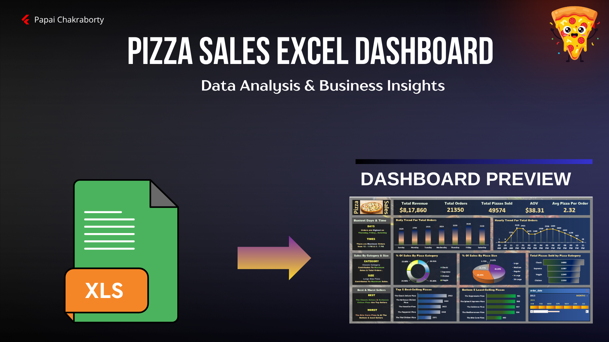
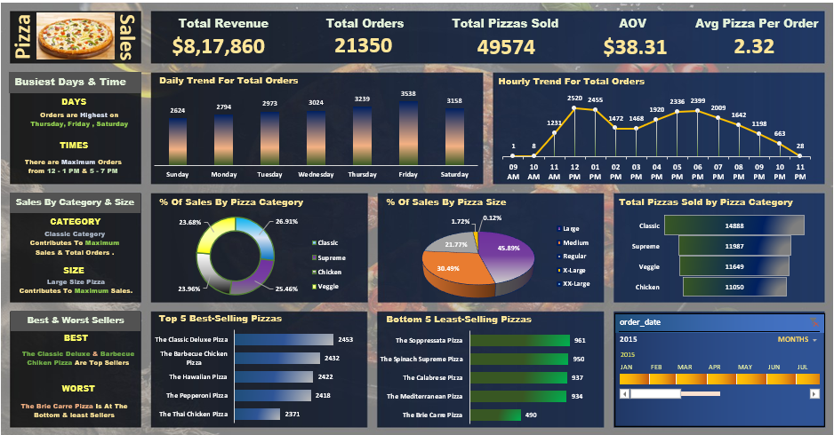

# Pizza Sales Excel Dashboard

##  Project Overview
An interactive Pizza Sales Dashboard built in Microsoft Excel to analyze sales performance, customer behavior, and product trends. The dashboard converts raw sales data into meaningful business insights using KPIs, charts, slicers, and data visualization techniques.

---

##  Tools Used
- Microsoft Excel
- Pivot Tables
- Pivot Charts
- Slicers
- Data Cleaning
- Dashboard Design

---

##  Key KPIs
- Total Revenue
- Total Orders
- Total Pizzas Sold
- Average Order Value (AOV)
- Average Pizzas Per Order

---

##  Dashboard Analysis
- Daily & Hourly Order Trends
- Sales by Category & Size
- Top & Bottom Performing Pizzas
- Peak Ordering Hours
- Customer Ordering Patterns

---

##  Dashboard Preview

### Main Dashboard

---

##  Key Insights
- Orders peak on Thursday, Friday, and Saturday.
- Peak ordering hours occur during lunch and evening time.
- Classic and Supreme categories generate the highest sales.
- Large and Medium sizes are the most preferred.
- Classic Deluxe Pizza is the top-selling product.
- Brie Carre Pizza is the least-selling product.

---

##  Business Recommendations
- Increase staffing and inventory during peak hours.
- Introduce combo offers and upselling strategies.
- Run targeted promotions during high-demand periods.
- Focus on high-performing products and categories.

---

## 🔗 Related SQL Project
This dashboard was developed using insights from a separate SQL-based Pizza Sales Analysis project.
SQL Project Repository: [Pizza Sales Analysis SQL Project](https://github.com/papaichakraborty-ai/Pizza-Sales-Analysis-Sql-Project)
---

##  Project Structure
- Data
- Dashboard
- Report
- Images

---

##  Author
Papai Chakraborty
